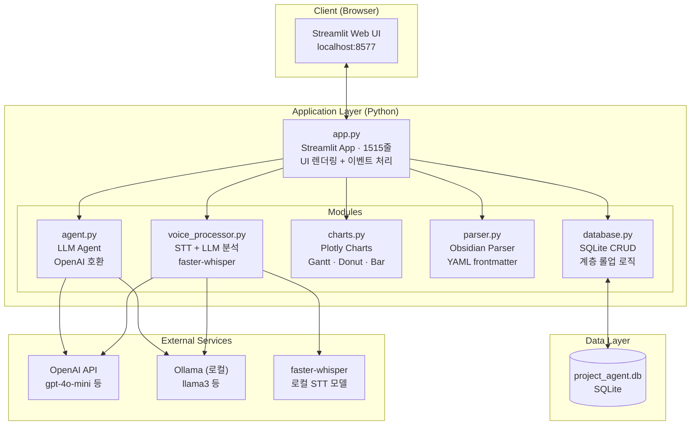
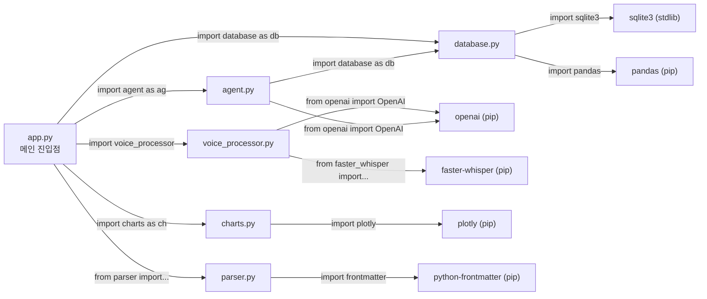
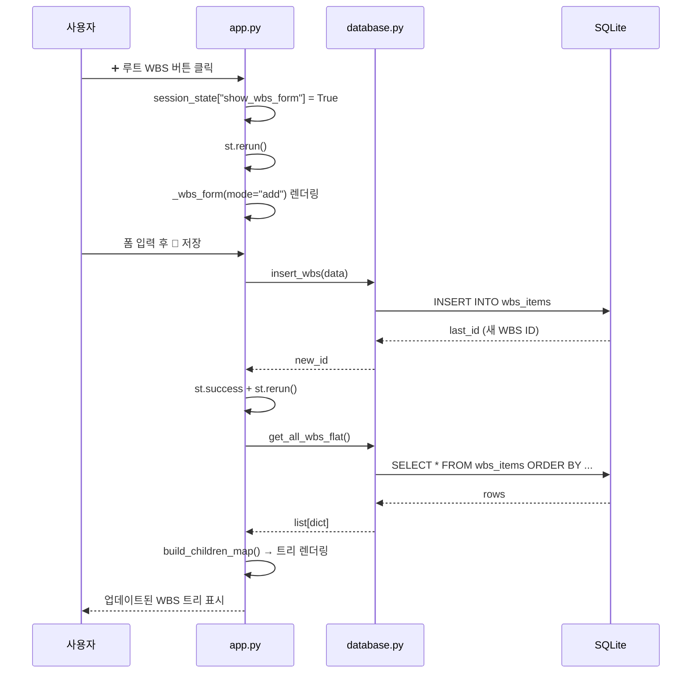
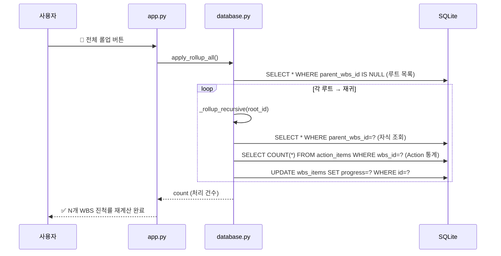
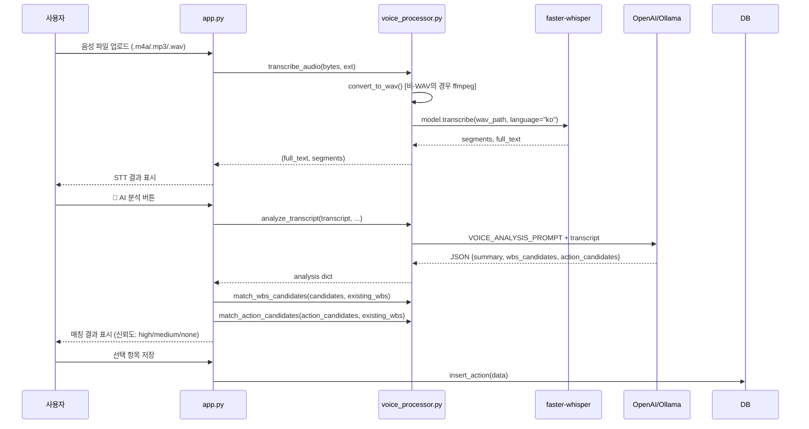
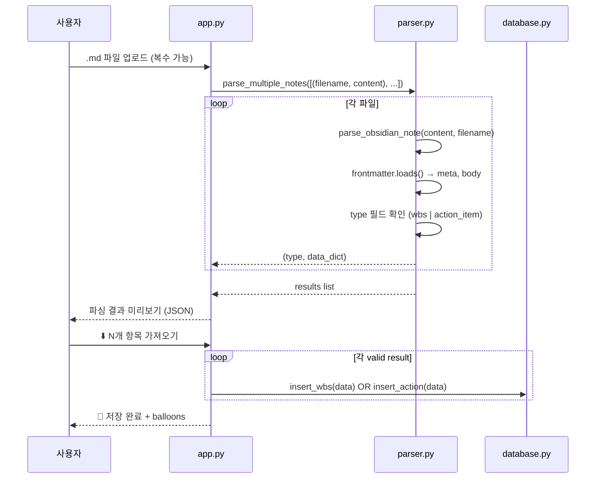
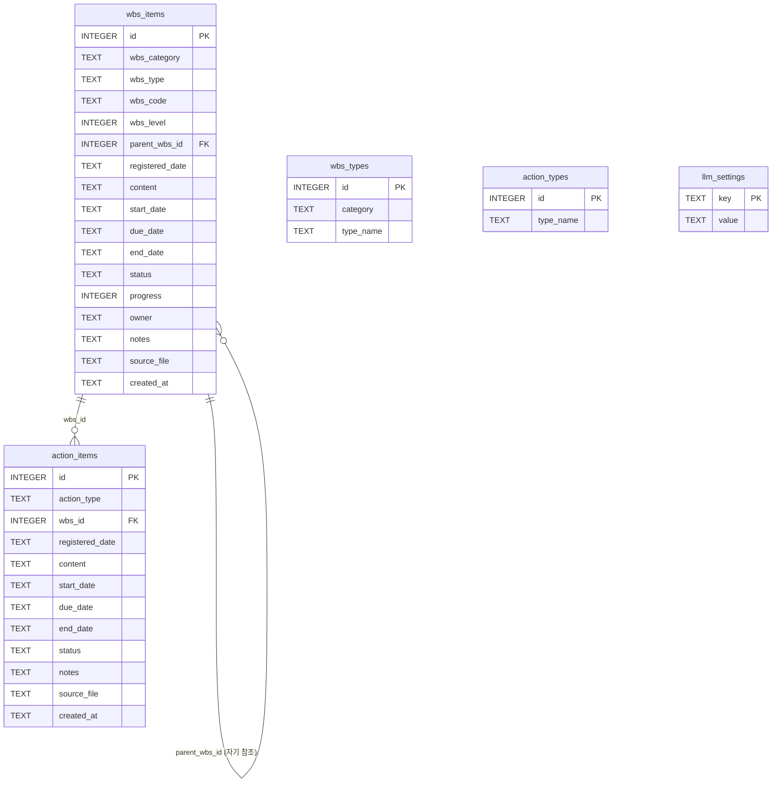
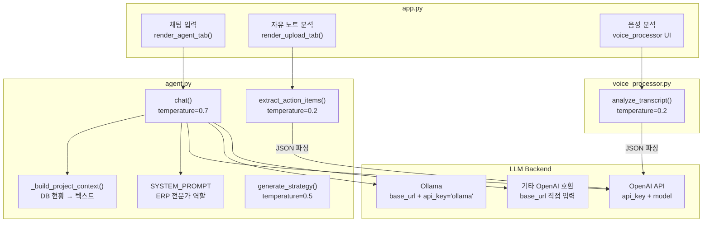

# 시스템 아키텍처 — Project Agent (WBS & Action Item 관리)

> SAP Sales Process ERP 구현 프로젝트 관리 도구  
> 버전: 2025.05 | 언어: Python 3.11+ | 프레임워크: Streamlit

---

## 목차

1. [전체 시스템 아키텍처](#1-전체-시스템-아키텍처)
2. [모듈 의존성 다이어그램](#2-모듈-의존성-다이어그램)
3. [데이터 흐름 다이어그램](#3-데이터-흐름-다이어그램)
4. [DB 스키마 (완전판)](#4-db-스키마-완전판)
5. [모듈별 API 레퍼런스](#5-모듈별-api-레퍼런스)
6. [계층 구조 알고리즘](#6-계층-구조-알고리즘)
7. [LLM 통합 아키텍처](#7-llm-통합-아키텍처)
8. [음성 처리 파이프라인](#8-음성-처리-파이프라인)
9. [Obsidian 연동 스키마](#9-obsidian-연동-스키마)

---

## 1. 전체 시스템 아키텍처



---

## 2. 모듈 의존성 다이어그램



---

## 3. 데이터 흐름 다이어그램

### 3-1. WBS 생성 흐름



### 3-2. 진척률 롤업 흐름



### 3-3. 음성 메모 처리 흐름



### 3-4. Obsidian 노트 업로드 흐름



---

## 4. DB 스키마 (완전판)

### ERD



### 테이블 상세

#### `wbs_items`

| 컬럼 | 타입 | NOT NULL | 기본값 | 설명 |
|------|------|----------|--------|------|
| `id` | INTEGER | ✓ | AUTOINCREMENT | PK |
| `wbs_category` | TEXT | | | 카테고리 (wbs_types.category 참조) |
| `wbs_type` | TEXT | | | 항목 유형 (wbs_types.type_name 참조) |
| `wbs_code` | TEXT | | `''` | 계층 코드 (예: `1.1`, `2.1.1`) |
| `wbs_level` | INTEGER | | `1` | 깊이 (루트=1, 자식=2, ...) |
| `parent_wbs_id` | INTEGER | | NULL | 부모 WBS id (NULL=루트) |
| `registered_date` | TEXT | | | 등록일 `YYYY-MM-DD` |
| `content` | TEXT | | | 상세 내용 |
| `start_date` | TEXT | | | 시작일 `YYYY-MM-DD` 또는 `''` |
| `due_date` | TEXT | | | 종료예정일 |
| `end_date` | TEXT | | | 실제 종료일 |
| `status` | TEXT | | `'todo'` | `scheduled`/`in_progress`/`done`/`cancelled` |
| `progress` | INTEGER | | `0` | 0~100 진척률 |
| `owner` | TEXT | | `''` | 담당자 이름 |
| `notes` | TEXT | | | 기타 메모 |
| `source_file` | TEXT | | | 업로드 원본 파일명 |
| `created_at` | TEXT | | `CURRENT_TIMESTAMP` | DB 저장 시각 |

> **참고**: `status` 기본값은 `'todo'`로 정의되어 있으나, `insert_wbs()`에서 명시적으로 `'scheduled'`를 지정하므로 실제 WBS 항목의 초기값은 `'scheduled'`입니다.

#### `action_items`

| 컬럼 | 타입 | NOT NULL | 기본값 | 설명 |
|------|------|----------|--------|------|
| `id` | INTEGER | ✓ | AUTOINCREMENT | PK |
| `action_type` | TEXT | | | 유형 (action_types.type_name 참조) |
| `wbs_id` | INTEGER | | NULL | 귀속 WBS id (NULL=독립 Action) |
| `registered_date` | TEXT | | | 등록일 |
| `content` | TEXT | | | 할 일 내용 |
| `start_date` | TEXT | | | 시작일 |
| `due_date` | TEXT | | | 종료예정일 |
| `end_date` | TEXT | | | 실제 종료일 |
| `status` | TEXT | | `'todo'` | `todo`/`in_progress`/`done`/`blocked` |
| `notes` | TEXT | | | 기타 메모 |
| `source_file` | TEXT | | | 업로드 원본 파일명 |
| `created_at` | TEXT | | `CURRENT_TIMESTAMP` | DB 저장 시각 |

#### `wbs_types`

| 컬럼 | 타입 | 제약 | 설명 |
|------|------|------|------|
| `id` | INTEGER | PK AUTOINCREMENT | |
| `category` | TEXT | NOT NULL | 카테고리명 (예: "To be process 개발") |
| `type_name` | TEXT | NOT NULL | 유형명 (예: "process 체계도") |
| | | UNIQUE(category, type_name) | 중복 방지 |

**기본 데이터** (`DEFAULT_WBS_TYPES` in database.py):

| category | type_name |
|----------|-----------|
| To be process 개발 | process 체계도 |
| To be process 개발 | process map |
| To be process 개발 | 시스템 요건 정의서 |
| To be process 개발 | Fit-n-Gap 해결방안 정의 |
| To be process 개발 | 통합 테스트 시나리오 |
| Proto typing | 프로세스 설계 |
| Proto typing | 조직구조 |
| Proto typing | 데이터 정의 |
| Proto typing | Configuration |
| Proto typing | 개발항목 및 인터페이스 정의 |
| Sub-project | 매출마감 통합관리 체계 구축 |
| Sub-project | Special Deal and rebate 프로세스 개선 |
| Sub-project | 주문 통합 시스템 구축 |
| Sub-project | 고객별 출하조건 기반-재고 할당 시뮬레이션 시스템 구축 |
| Sub-project | RMA 프로세스 간소화 |
| Sub-project | PO전량 관리 프로세스 구축 |
| Risk 관리 | L4 기준으로 개발정의서 작성하는 불합리성 대응 |
| Risk 관리 | RAP modeling 역량 미확보로 인한 스펙정의서 작성 속도 지연 및 품질 저하 우려 |

#### `action_types`

| 컬럼 | 타입 | 제약 | 설명 |
|------|------|------|------|
| `id` | INTEGER | PK AUTOINCREMENT | |
| `type_name` | TEXT | NOT NULL UNIQUE | 유형명 |

**기본 데이터** (`DEFAULT_ACTION_TYPES` in database.py):
- task list 및 관련 일정표 작성
- 미팅(출장)
- 문서작성
- 개발(분석/설계)
- 준비작업
- 역량확보
- 테스트

#### `llm_settings`

| key | value 예시 | 설명 |
|-----|-----------|------|
| `api_key` | `sk-...` | OpenAI API 키 |
| `base_url` | `http://localhost:11434/v1` | 로컬 LLM 엔드포인트 |
| `model` | `gpt-4o-mini` | 사용할 모델명 |

---

## 5. 모듈별 API 레퍼런스

### 5-1. `database.py`

#### DB 연결

```python
def get_conn() -> sqlite3.Connection:
    """SQLite 커넥션 반환. check_same_thread=False."""

def init_db():
    """
    DB 초기화 및 마이그레이션.
    - 테이블 CREATE IF NOT EXISTS
    - ALTER TABLE (신규 컬럼 추가, 오류 무시)
    - 기본 마스터 데이터 INSERT OR IGNORE
    - app.py 시작 시 자동 호출
    """
```

#### WBS CRUD

```python
def get_wbs_items(filters: dict | None = None) -> pd.DataFrame:
    """
    WBS 항목 목록 조회.
    filters: {"category": str, "status": str}
    반환: registered_date DESC, id DESC 정렬
    """

def get_wbs_by_id(wbs_id: int) -> dict | None:
    """ID로 단건 WBS 조회. 없으면 None."""

def insert_wbs(data: dict) -> int:
    """
    WBS 삽입. 반환: new id
    data 키: wbs_category, wbs_type, registered_date, content,
             start_date, due_date, end_date, status, progress, notes,
             source_file, parent_wbs_id, wbs_code, wbs_level, owner
    """

def update_wbs(wbs_id: int, data: dict):
    """WBS 수정. data 키는 insert_wbs와 동일 (source_file 제외)."""

def delete_wbs(wbs_id: int):
    """WBS 삭제. 하위 자식 WBS도 재귀 삭제."""
```

#### WBS 계층 구조

```python
def get_wbs_children(parent_id: int | None) -> list[dict]:
    """
    직속 자식 목록 반환.
    parent_id=None이면 루트(parent_wbs_id IS NULL) 목록.
    정렬: wbs_code, id
    """

def get_all_wbs_flat() -> list[dict]:
    """전체 WBS를 wbs_level → wbs_code → id 순 정렬."""

def build_children_map(items: list[dict]) -> dict:
    """
    {parent_id: [child_dict, ...]} 매핑 생성.
    루트 항목은 {None: [...]}.
    """

def calculate_rollup_progress(wbs_id: int) -> int:
    """
    재귀적 진척률 계산 (DB 저장 없음).
    - 리프: Action 완료비율 OR 수동 progress
    - 부모: 활성 자식 평균
    """

def apply_rollup_progress(wbs_id: int) -> int:
    """진척률 계산 후 DB 저장. 계산값 반환."""

def apply_rollup_all() -> int:
    """루트부터 전체 재귀 롤업 후 DB 저장. 처리 건수 반환."""
```

#### Action Item CRUD

```python
def get_action_stats_for_wbs(wbs_id: int) -> dict:
    """
    반환: {total, done, in_progress, blocked, auto_progress}
    auto_progress = round(done/total * 100)
    """

def apply_auto_progress(wbs_id: int) -> int:
    """Action 완료 비율로 WBS progress 업데이트 후 저장."""

def get_action_items(filters: dict | None = None) -> pd.DataFrame:
    """
    Action 목록. action_items LEFT JOIN wbs_items.
    추가 컬럼: linked_wbs (wbs_type), linked_wbs_cat (wbs_category)
    filters: {"action_type": str, "status": str, "wbs_id": int}
    """

def get_action_by_id(action_id: int) -> dict | None:
    """ID로 단건 Action 조회."""

def insert_action(data: dict) -> int:
    """
    Action 삽입. 반환: new id
    data 키: action_type, registered_date, content, start_date,
             due_date, end_date, status, notes, wbs_id, source_file
    """

def update_action(action_id: int, data: dict):
    """Action 수정."""

def delete_action(action_id: int):
    """Action 삭제."""
```

#### 마스터 데이터

```python
def get_wbs_categories() -> list[str]:        # DISTINCT category 목록
def get_wbs_types_by_category(category: str) -> list[str]:  # 카테고리별 유형
def get_all_wbs_types() -> pd.DataFrame:       # 전체 WBS 유형 테이블
def add_wbs_type(category: str, type_name: str) -> bool:    # 추가, 중복시 False
def delete_wbs_type(type_id: int):             # ID로 삭제
def get_action_type_names() -> list[str]:      # Action 유형명 목록
def get_all_action_types() -> pd.DataFrame:    # 전체 Action 유형 테이블
def add_action_type(type_name: str) -> bool:   # 추가, 중복시 False
def delete_action_type(type_id: int):          # ID로 삭제
```

#### LLM 설정

```python
def get_llm_setting(key: str, default: str = "") -> str:
def set_llm_setting(key: str, value: str):
```

#### 대시보드

```python
def get_summary_stats() -> dict:
    """
    반환: {wbs_total, wbs_done, wbs_blocked, wbs_in_progress,
           act_total, act_done, act_blocked, act_in_progress,
           upcoming_wbs, upcoming_act, avg_progress}
    upcoming_*: 오늘~7일 이내 마감, 미완료 항목 수
    """

def get_gantt_data() -> pd.DataFrame:
    """start_date != '' AND due_date != '' 인 WBS 항목."""

def get_action_gantt_data() -> pd.DataFrame:
    """날짜 있는 Action + LEFT JOIN wbs_items."""
```

---

### 5-2. `agent.py`

```python
SYSTEM_PROMPT: str  # ERP 전문 컨설턴트 AI 역할 정의

def _build_project_context() -> str:
    """DB 현황 → LLM 컨텍스트 텍스트 생성 (통계 + 진행중/블록 WBS + 마감 초과 Action)."""

def _get_client(api_key: str, base_url: str) -> OpenAI | None:
    """OpenAI 클라이언트 생성. HAS_OPENAI=False이면 None."""

def chat(
    messages: list[dict],      # [{"role": "user"/"assistant", "content": "..."}]
    api_key: str = "",
    base_url: str = "",        # 로컬 LLM: "http://localhost:11434/v1"
    model: str = "gpt-4o-mini",
    include_project_context: bool = True,
) -> str:
    """LLM 채팅. temperature=0.7, max_tokens=2048."""

def extract_action_items_from_note(
    note_content: str,
    api_key: str = "",
    base_url: str = "",
    model: str = "gpt-4o-mini",
) -> list[dict]:
    """
    자유 노트 → Action Item 추출.
    반환: [{"action_type", "content", "due_date", "status"}, ...]
    temperature=0.2 (정확도 우선)
    """

def generate_strategy(
    api_key: str = "",
    base_url: str = "",
    model: str = "gpt-4o-mini",
) -> str:
    """현황 기반 전략 보고서 생성. temperature=0.5, max_tokens=3000."""
```

---

### 5-3. `charts.py`

```python
STATUS_COLOR: dict  # {"todo": "#64748b", "in_progress": "#f59e0b", ...}
CATEGORY_COLORS: list  # 카테고리별 색상 팔레트 (8색 순환)

def make_gantt(df: pd.DataFrame, title: str = "WBS Gantt Chart") -> go.Figure:
    """
    WBS 또는 Action Item Gantt 차트.
    필수 컬럼: start_date, due_date, status
    선택 컬럼: wbs_category, wbs_type (WBS용) | action_type, content (Action용)
    특징:
    - 오늘 날짜 수직 빨간 점선
    - 진척률 녹색 오버레이 (progress > 0 인 경우)
    - 상태별 색상 바
    - barmode="overlay"
    - 빈 df이면 "데이터 없음" 안내 Figure 반환
    """

def make_status_donut(stats: dict, mode: str = "wbs") -> go.Figure:
    """
    상태 도넛 차트. hole=0.65
    mode="wbs": WBS 통계 사용
    mode="act": Action 통계 사용
    labels: ["대기", "진행중", "완료", "블록"]
    """

def make_progress_bar_chart(df: pd.DataFrame) -> go.Figure:
    """
    WBS 항목별 진척률 수평 막대 (상위 12개).
    상태색으로 bar 색상 적용.
    """

def make_category_timeline(df: pd.DataFrame) -> go.Figure:
    """
    월별 등록 현황 스택 막대.
    x축: registered_date → 월(period)
    y축: 건수
    color: status
    """
```

---

### 5-4. `parser.py`

```python
def parse_obsidian_note(content: str, filename: str = "") -> tuple[str | None, dict | str]:
    """
    Obsidian 마크다운 → (type, data) 파싱.
    - python-frontmatter 있으면 사용, 없으면 수동 파싱
    - type="wbs": WBS data dict 반환
    - type="action_item": Action data dict 반환
    - 알 수 없는 type: (None, error_message)
    """

def _safe_str(value) -> str:
    """None/NaN/None/null 안전 문자열 변환."""

def _extract_section(content: str, section_name: str) -> str:
    """## 섹션명 아래 본문 추출 (다음 ## 전까지)."""

def _manual_parse(content: str) -> tuple[dict, str]:
    """
    python-frontmatter 없을 때 수동 파싱.
    --- 블록을 라인 단위로 파싱, key: value 추출.
    """

def parse_multiple_notes(file_contents: list[tuple[str, str]]) -> list[dict]:
    """
    여러 파일 일괄 파싱.
    입력: [(filename, content), ...]
    반환: [{"filename", "type", "data", "success"}, ...]
    """
```

---

### 5-5. `voice_processor.py`

```python
def _get_whisper_model(model_size: str = "small") -> WhisperModel | None:
    """WhisperModel 전역 캐시 (최초 1회 로드 후 재사용)."""

def convert_to_wav(src_bytes: bytes, src_ext: str) -> bytes:
    """
    ffmpeg으로 WAV(16kHz, mono)로 변환.
    입력: .m4a, .mp3, .ogg 등
    임시 파일 사용 후 삭제.
    """

def transcribe_audio(
    file_bytes: bytes,
    file_ext: str,
    model_size: str = "small",  # tiny | small | medium | large
    language: str = "ko",
) -> tuple[str, list[dict]]:
    """
    STT 수행.
    반환: (full_text, segments)
    segments: [{"start": float, "end": float, "text": str}, ...]
    vad_filter=True (무음 자동 제거)
    """

def analyze_transcript(
    transcript: str,
    api_key: str = "",
    base_url: str = "",
    model: str = "gpt-4o-mini",
) -> dict:
    """
    텍스트 → 구조화 분석.
    반환: {summary, meeting_date, attendees, wbs_candidates, action_candidates}
    temperature=0.2 (정확도 우선)
    transcript 최대 4000자 잘림
    """

def match_wbs_candidates(
    candidates: list[dict],
    existing_wbs: list[dict],
) -> list[dict]:
    """
    WBS 후보 → 기존 WBS 매칭.
    매칭 우선순위:
    1. wbs_code 완전 일치 → confidence="high"
    2. wbs_type 완전 일치 → confidence="high"
    3. 50% 이상 문자 공통 → confidence="medium"
    반환: [{"candidate": {...}, "matched": dict|None, "confidence": "high"|"medium"|"none"}]
    """

def match_action_candidates(
    action_candidates: list[dict],
    existing_wbs: list[dict],
) -> list[dict]:
    """
    Action 후보의 wbs_ref_hint → WBS ID 매칭 (부분 문자열 매칭).
    반환: action_candidates + matched_wbs_id 필드 추가
    """

def make_meeting_note_md(
    transcript: str,
    analysis: dict,
    filename: str = "",
) -> str:
    """음성 분석 결과 → Obsidian 회의록 .md 생성."""
```

---

## 6. 계층 구조 알고리즘

### 6-1. 트리 구축

```python
# 1단계: 전체 WBS 플랫 조회
all_items = get_all_wbs_flat()  # ORDER BY wbs_level, wbs_code, id

# 2단계: 부모-자식 매핑 딕셔너리
cmap = build_children_map(all_items)
# cmap = {
#   None: [root1, root2, ...],      # 루트 노드
#   1: [child_of_1, ...],           # id=1의 자식들
#   2: [child_of_2_a, ...],
#   ...
# }

# 3단계: 재귀 렌더링
roots = cmap.get(None, [])
for node in roots:
    _render_wbs_node(node, depth=1, cmap=cmap)
```

### 6-2. 진척률 롤업 알고리즘

```
calculate_rollup_progress(wbs_id):
  children = get_wbs_children(wbs_id)
  
  if not children:  # 리프 노드
    stats = get_action_stats_for_wbs(wbs_id)
    if stats.total > 0:
      return round(stats.done / stats.total * 100)
    else:
      return wbs.progress  # 수동 진척률
  
  else:  # 부모 노드
    active = [c for c in children if c.status != "cancelled"]
    if not active:
      return 0
    return round(avg([calculate_rollup_progress(c.id) for c in active]))
```

### 6-3. wbs_code 기반 부모 자동 탐색

WBS 마법사 완료 시 `wbs_code`에서 부모를 자동 탐색:

```python
# "1.2.3" → 부모 코드 = "1.2"
if wbs_code and "." in wbs_code:
    parent_code = ".".join(wbs_code.split(".")[:-1])
    match = [w for w in all_wbs if w["wbs_code"] == parent_code]
    if match:
        par_id = match[0]["id"]
        lvl = match[0]["wbs_level"] + 1
```

---

## 7. LLM 통합 아키텍처



### LLM 설정 우선순위

| 조건 | 동작 |
|------|------|
| `api_key` 설정, `base_url` 없음 | OpenAI 공식 API |
| `api_key` 없음, `base_url` 설정 | Ollama 또는 로컬 LLM (api_key="ollama") |
| 둘 다 설정 | 지정한 base_url의 API 사용 |
| 둘 다 없음 | 경고 표시, AI 기능 비활성 |

---

## 8. 음성 처리 파이프라인

```
[음성 파일]
    │
    ▼ (비-WAV의 경우)
[ffmpeg 변환] → WAV 16kHz mono
    │
    ▼
[faster-whisper STT]
    │ WhisperModel(model_size, device="auto", compute_type="auto")
    │ M1/M2 Mac: CoreML 자동 감지
    │ vad_filter=True, min_silence_duration_ms=500
    ▼
[full_text, segments]
    │
    ▼
[LLM 분석] → VOICE_ANALYSIS_PROMPT
    │ JSON 반환: summary, meeting_date, attendees,
    │           wbs_candidates, action_candidates
    ▼
[WBS 매칭]           [Action 매칭]
match_wbs_candidates  match_action_candidates
    │                      │
    ▼                      ▼
[confidence: high/medium/none]  [matched_wbs_id]
    │
    ▼
[사용자 검토 및 선택 저장]
    │
    ▼
[DB 저장] insert_action() / insert_wbs()
```

### 지원 오디오 포맷

| 포맷 | 직접 처리 | ffmpeg 변환 필요 |
|------|-----------|-----------------|
| WAV | ✓ | - |
| MP3 | - | ✓ |
| M4A | - | ✓ |
| OGG | - | ✓ |
| FLAC | - | ✓ |

---

## 9. Obsidian 연동 스키마

### YAML Frontmatter 파싱 규칙

```
parser.py 파싱 우선순위:
1. python-frontmatter 라이브러리 사용
2. ImportError 시 _manual_parse() 폴백 (수동 YAML 파싱)

type 필드 → 분기:
- "wbs"         → WBS 항목 데이터 추출
- "action_item" → Action Item 데이터 추출
- 기타          → 오류 메시지 반환
```

### 본문 섹션 자동 추출

```
WBS 노트 본문에서:
  "## 내용" 섹션 → wbs.content
  "## 기타 특이사항" 섹션 → wbs.notes

Action Item 노트 본문에서:
  "## 내용" 섹션 → action.content (또는 "## 할 일 내용")
  "## 기타" 섹션 → action.notes
```

### wbs_ref 자동 WBS 귀속

업로드된 Action Item 노트의 `wbs_ref` 필드:

```yaml
wbs_ref: "1.1"  # WBS 코드로 자동 귀속 시도
```

> **현재 구현**: `wbs_ref` 파싱은 되지만, 업로드 시 자동 WBS ID 매핑은 미구현. 수동으로 Action Items 탭에서 연결 필요.

---

## 부록: 상태 코드 정의

### WBS 상태 (`wbs_items.status`)

| 값 | 레이블 | 이모지 | 색상 | 의미 |
|----|--------|--------|------|------|
| `scheduled` | 예정 | ⏳ | `#64748b` | 아직 시작 안 됨 |
| `in_progress` | 실행중 | 🔄 | `#f59e0b` | 진행 중 |
| `done` | 완료 | ✅ | `#22c55e` | 완료됨 |
| `cancelled` | 취소 | 🚫 | `#475569` | 취소됨 (롤업 제외) |

### Action Item 상태 (`action_items.status`)

| 값 | 레이블 | 이모지 | 색상 | 의미 |
|----|--------|--------|------|------|
| `todo` | 대기 | ⬜ | `#64748b` | 미착수 |
| `in_progress` | 진행중 | 🔄 | `#f59e0b` | 진행 중 |
| `done` | 완료 | ✅ | `#22c55e` | 완료됨 (자동 진척률에 반영) |
| `blocked` | 블록 | 🚫 | `#ef4444` | 차단됨 |
